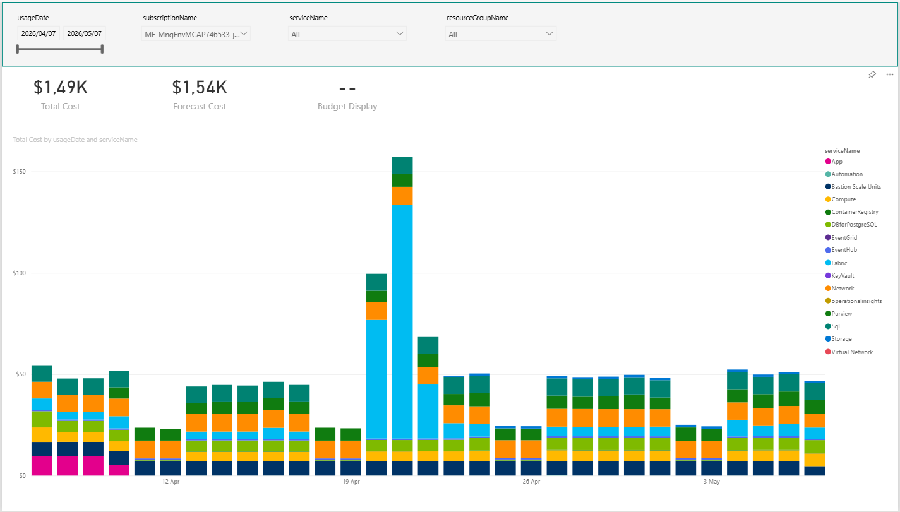
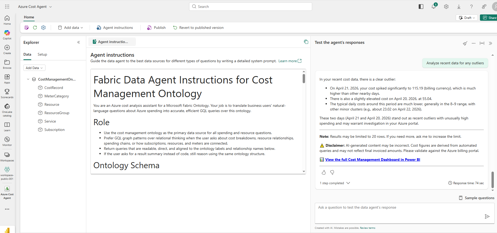
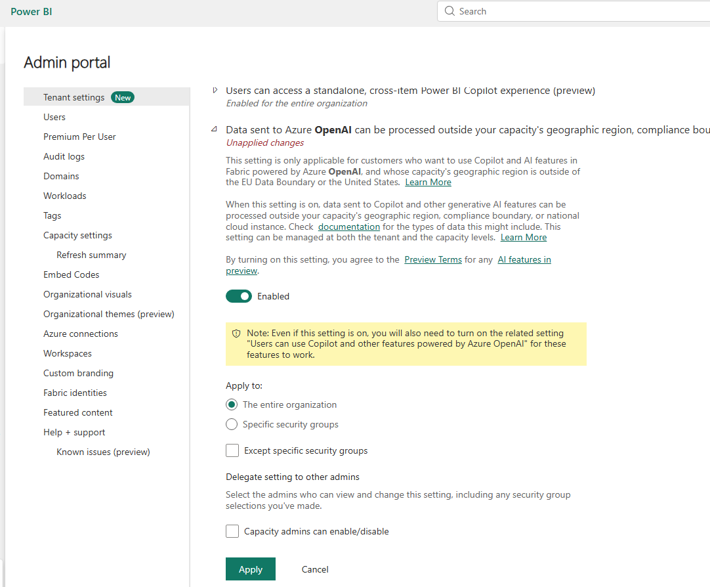
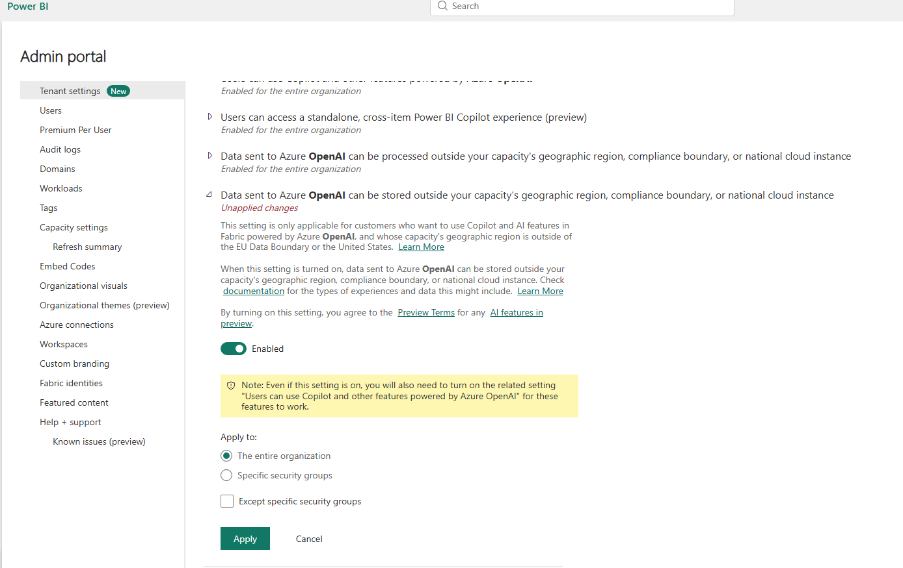

# Azure Cost Management Ontology for Microsoft Fabric

<p align="center">
  
  
</p>

Build a Fabric Ontology, Power BI dashboard, and AI Data Agent from Azure cost data -- per resource, per day, fully automated.

<p align="center">
  <b>Azure Cost Power BI Dashboard</b><br/>
  
  <br/><br/>
  <b>Azure Cost Data Agent</b><br/>
  
</p>

## What This Does

Three local scripts + five Fabric notebooks handle everything:

| Step | Where | Script / Notebook | What it Does |
|------|-------|-------------------|-------------|
| 1 | Local | `GetKeys.ps1` | Creates SPN, assigns Cost Management Reader, writes `.env`, optionally provisions Key Vault |
| 2 | Local | `SetDashboardConnectionString.ps1` | Injects Lakehouse connection into the local PBI project (for local dev only) |
| 3 | Local | `UploadNotebooks.ps1` | Uploads all notebooks + dashboard assets to Fabric with Lakehouse pre-attached |
| 4 | Fabric | `01_download_cost_data` | Downloads cost CSVs in <=30-day chunks, writes 6 Delta tables |
| 5 | Fabric | `02_deploy_dashboard` | Patches connection string, deploys Semantic Model + Report, saves IDs to `.env` |
| 6 | Fabric | `03_create_cost_ontology` | Builds ontology + graph DB via Fabric REST API |
| 7 | Fabric | `04_create_data_agent` | Creates/updates Data Agent with ontology + dashboard link |
| -- | Fabric | `00_clear_cost_deltafiles` | Drops all tables + staging CSVs (on-demand utility) |

---


## Quick Start

### Prerequisites

#### Software

| Tool | Version | Purpose |
|------|---------|---------|
| **Azure CLI** (`az`) | 2.50+ | Auth, SPN creation, role assignments |
| **PowerShell** | 5.1+ (ships with Windows) | Running local scripts |
| **Power BI Desktop** | Latest (optional) | Local dashboard editing via `.pbip` (requires Developer Mode) |

> Install Azure CLI: https://learn.microsoft.com/en-us/cli/azure/install-azure-cli

#### Azure / Fabric Resources

| Resource | Notes |
|----------|-------|
| **Azure subscription** | With cost data to analyse |
| **Microsoft Fabric workspace** | On a Fabric capacity (trial or paid) |
| **Lakehouse** in that workspace | Created manually in the portal (one-time) |

#### Azure RBAC / IAM Permissions

The **logged-in user** (the person running `az login`) needs:

| Permission | Scope | Why |
|------------|-------|-----|
| **Cloud Application Administrator** (Entra role) or `Application.ReadWrite.All` | Entra ID tenant | `GetKeys.ps1` creates an App Registration and Service Principal |
| **Owner** or **User Access Administrator** | Azure subscription | `GetKeys.ps1` assigns the *Cost Management Reader* role to the SPN |
| **Contributor** (optional) | Resource group `rg-cost-management-keys` | Only if using `GetKeys.ps1 -KeyVaultName` to create a Key Vault |

The **Service Principal** (`CostManagement-Fabric-SPN`, created by `GetKeys.ps1`):

| Role | Scope | Why |
|------|-------|-----|
| **Cost Management Reader** | Azure subscription | `01_download_cost_data` calls the Cost Details Report API |

#### Fabric Workspace Permissions

| Role | Who | Why |
|------|-----|-----|
| **Contributor** (minimum) | Logged-in user | Upload scripts create/update items via Fabric REST API and OneLake |
| **Admin** | Logged-in user (optional) | Only needed to create a Workspace Identity for Key Vault integration in scheduled pipelines |

#### Key Vault Permissions (optional -- only with `-KeyVaultName`)

| Role | Who | Scope | Why |
|------|-----|-------|-----|
| **Key Vault Secrets User** | Fabric Workspace Identity | Key Vault | Notebooks use `mssparkutils.credentials.getSecret()` at pipeline runtime |

> Create the workspace identity: Workspace Settings -> Workspace identity -> + Workspace identity. Then assign **Key Vault Secrets User** to it on your vault's IAM page.

---

### 1. Create Service Principal + `.env` (local)

```powershell
az login
.\GetKeys.ps1
```

This creates `CostManagement-Fabric-SPN`, assigns **Cost Management Reader**, and writes credentials to `.env`.

To store secrets in Key Vault (recommended for shared/pipeline use):

```powershell
.\GetKeys.ps1 -KeyVaultName "kv-costmgmt-yourname"
```

### 2. Configure Lakehouse connection

Edit `.env` and set your Lakehouse details:

```ini
LAKEHOUSE_SQL_ENDPOINT=your-endpoint.datawarehouse.fabric.microsoft.com
LAKEHOUSE_DATABASE=your-lakehouse-name
```

> **Finding your Lakehouse SQL endpoint:** Fabric portal -> your workspace -> open Lakehouse -> Settings -> SQL analytics endpoint -> copy the **Server** value.

### 3. Upload everything to Fabric (local)

```powershell
.\UploadNotebooks.ps1
```

This uploads all notebooks (with Lakehouse pre-attached), the dashboard folder, and `data_agent_instructions.md` to your Fabric workspace.

### 4. Run notebooks in Fabric

Open each notebook in the Fabric portal and click **Run all**, in order:

| Order | Notebook | Time | What Happens |
|-------|----------|------|-------------|
| 1 | `01_download_cost_data` | ~5 min | Downloads cost data, writes 6 Delta tables |
| 2 | `02_deploy_dashboard` | ~1 min | Deploys PBI Semantic Model + Report, saves report ID to `.env` |
| 3 | `03_create_cost_ontology` | ~10 min | Creates ontology + graph database |
| 4 | `04_create_data_agent` | ~1 min | Creates Data Agent with ontology + dashboard link |

### 5. Configure Semantic Model credentials (one-time)

After `02_deploy_dashboard` runs for the first time, the Semantic Model needs an explicit cloud connection before it can refresh data:

1. Open your workspace in the Fabric portal
2. Find **AzureBillingDashboard** (Semantic Model) -> click **...** -> **Settings**
3. Scroll to **Gateway and cloud connections**
4. Click the dropdown next to the SQL connection -> **Create a new connection**
5. Set **Authentication method** to **OAuth2** -> click **Sign in** -> authenticate with your Entra ID
6. Set **Privacy level** to **Organizational**
7. Click **Apply**
8. Back on the Semantic Model page, click **Refresh now**

This only needs to be done once. Subsequent refreshes reuse the saved connection.

---

## Scheduling (optional)

Deploy the `pipeline-azurecost` pipeline (which runs notebooks `01` -> `03` -> `04` in sequence) and its schedule:

```powershell
.\UploadPipeline.ps1
```

By default the pipeline runs every 6 hours. Edit `pipeline/schedule.json` to change the frequency.

> **Key Vault setup for pipelines:** Create a workspace identity (Workspace Settings -> Workspace identity), then grant it **Key Vault Secrets User** on your vault. Notebooks auto-detect Key Vault via `KEY_VAULT_URL` in `.env`.

---

## Publish Data Agent to Teams (optional)

After the pipeline has run at least once (so the Data Agent exists in your workspace), you can publish it to Microsoft Teams via the M365 Copilot Agent Store:

1. Open your **Data Agent** in the Fabric portal
2. Click **Publish**, then select **Publish to Agent Store**
3. In Teams, users type `@` in the Copilot chat to see available agents and select yours
4. Ensure users have **read access** to the Fabric Data Agent and the necessary permissions for all underlying data sources

> It may take a few seconds for the agent to appear. If agents don't show, ask your M365 admin to confirm [Copilot extensibility is enabled](https://learn.microsoft.com/microsoft-365/admin/manage/manage-plugins-for-copilot-in-integrated-apps).

<p align="center">
  
  <br/>
  
</p>

---

## Local Power BI Development (optional)

To edit the dashboard locally in Power BI Desktop:

```powershell
.\SetDashboardConnectionString.ps1
```

Then open `dashboard/AzureBillingDashboard.pbip` in Power BI Desktop (requires Developer Mode enabled in preview features).

---

## Ontology Design

```
Subscription --has_resource_group--> ResourceGroup
ResourceGroup --contains_resource--> Resource
Resource --incurs_cost--> CostRecord
CostRecord --billed_under--> MeterCategory
CostRecord --consumed_by--> Service
Subscription --billed_by--> CostRecord
```

### Entity Types

| Entity | Table | Key | Description |
|--------|-------|-----|-------------|
| Subscription | `subscription` | subscriptionId | Azure subscription (billing root) |
| ResourceGroup | `resource_group` | resourceGroupId | Logical container for resources |
| Resource | `resource` | resourceId | Individual Azure resource (VM, storage, etc.) |
| CostRecord | `cost_record` | costRecordId | Daily cost per resource (fact table) |
| MeterCategory | `meter_category` | meterId | Billing meter: category -> subcategory -> name |
| Service | `service` | serviceId | Consumed Azure service + charge type |

### Relationships

| Relationship | Source -> Target | Meaning |
|-------------|----------------|---------|
| `has_resource_group` | Subscription -> ResourceGroup | Subscription owns resource groups |
| `contains_resource` | ResourceGroup -> Resource | Resource group contains resources |
| `incurs_cost` | Resource -> CostRecord | Resource generates cost records |
| `billed_under` | CostRecord -> MeterCategory | Cost classified under a billing meter |
| `consumed_by` | CostRecord -> Service | Cost emitted by an Azure service |
| `billed_by` | Subscription -> CostRecord | Direct link for subscription-level aggregation |

---

## Sample Graph Queries

**Total cost by resource group:**
```gql
GRAPH CostManagementOntology
MATCH (s:Subscription)-[:has_resource_group]->(rg:ResourceGroup)
      -[:contains_resource]->(r:Resource)
      -[:incurs_cost]->(c:CostRecord)
RETURN rg.resourceGroupName, SUM(c.preTaxCost) AS totalCost
ORDER BY totalCost DESC
```

**Top 10 most expensive resources:**
```gql
GRAPH CostManagementOntology
MATCH (r:Resource)-[:incurs_cost]->(c:CostRecord)
RETURN r.resourceId, r.resourceType, SUM(c.preTaxCost) AS totalCost
ORDER BY totalCost DESC
LIMIT 10
```

**Cost by meter category:**
```gql
GRAPH CostManagementOntology
MATCH (c:CostRecord)-[:billed_under]->(m:MeterCategory)
RETURN m.meterCategory, SUM(c.preTaxCost) AS totalCost
ORDER BY totalCost DESC
```

**Daily spend trend:**
```gql
GRAPH CostManagementOntology
MATCH (s:Subscription)-[:billed_by]->(c:CostRecord)
RETURN c.usageDate AS date, SUM(c.preTaxCost) AS dailyCost, c.Currency
ORDER BY date ASC
```

---

## Troubleshooting

| Error | Cause | Fix |
|-------|-------|-----|
| 429 Too Many Requests | Cost API rate limit | Built-in retry handles this automatically |
| Tables not found | Notebook 01 hasn't run | Run `01_download_cost_data` first |
| Ontology not found | Notebook 03 hasn't run | Run `03_create_cost_ontology` first |
| PBI report not rendering | Missing Lakehouse connection | Check `LAKEHOUSE_SQL_ENDPOINT` and `LAKEHOUSE_DATABASE` in `.env` |
| Data Agent missing dashboard link | Notebook 02 hasn't run | Run `02_deploy_dashboard` before `04_create_data_agent` |

---

## Security Notes

- **Without Key Vault**: `.env` contains `AZURE_CLIENT_SECRET` in plain text on Lakehouse Files. Acceptable for local dev, not recommended for shared workspaces.
- **With Key Vault**: Notebooks auto-detect `KEY_VAULT_URL` in `.env` and pull secrets via `mssparkutils.credentials.getSecret()`. The secret never leaves the vault.
- No secrets are stored in notebooks or committed to the repo.
